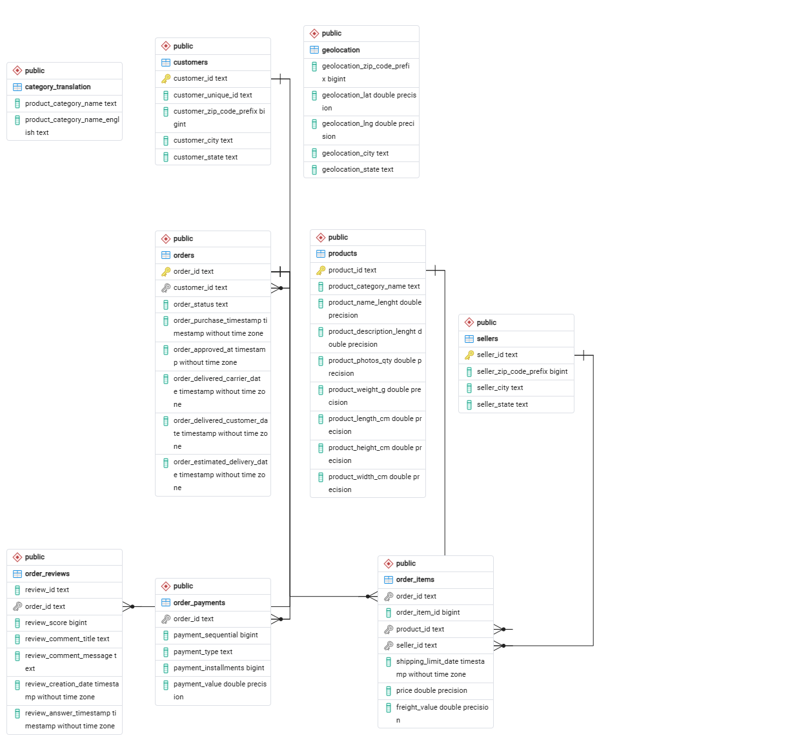

# 🛒 SQL Business Analysis on Brazilian E-Commerce Dataset

A complete SQL project built using PostgreSQL to solve real-world business problems on the Brazilian Olist E-Commerce dataset.

This project demonstrates SQL skills ranging from basic querying to advanced analytics using joins, subqueries, Common Table Expressions (CTEs), window functions, and views.

---

## 📂 Dataset

This project uses the **Brazilian E-Commerce Public Dataset by Olist**.

**Dataset Link:**  
https://www.kaggle.com/datasets/olistbr/brazilian-ecommerce

---

## 🗄 Database Schema



---

## 📌 Project Objectives

- Design a relational database schema
- Import CSV data into PostgreSQL
- Solve real-world business problems using SQL
- Perform analytical queries on e-commerce data
- Practice advanced PostgreSQL concepts

---

## 🛠 Tech Stack

- PostgreSQL
- pgAdmin 4
- SQL

---

## 🗂 Database Tables

- Customers
- Orders
- Order Items
- Products
- Sellers
- Order Payments
- Order Reviews
- Product Category Translation
- Geolocation

---

## 📚 SQL Concepts Covered

- SELECT
- WHERE
- ORDER BY
- GROUP BY
- HAVING
- Aggregate Functions
- CASE WHEN
- INNER JOIN
- LEFT JOIN
- Subqueries
- Common Table Expressions (CTEs)
- Window Functions
- Views

---

## 📈 Business Questions Solved

Some of the analyses performed include:

- Total customers, orders, sellers, and products
- Revenue generated by each seller
- Monthly revenue trend
- Top spending customers
- Average delivery time by state
- Products with missing categories
- Weekend vs Weekday orders
- Customer segmentation
- Executive sales report
- Running monthly revenue
- Month-over-month revenue growth
- Top products by category
- Top category of every state

**Total Queries:** 45+

---

## 📁 Repository Structure

```
sql-ecommerce-business-analysis/
│
├── E_COMMERCE.sql
├── schema.png
├── README.md
└── LICENSE
```

---

## 💡 Key Insights

- Identified top-performing sellers based on revenue
- Analyzed monthly sales trends and revenue growth
- Ranked products within each category
- Segmented customers by spending behavior
- Evaluated delivery performance across different states

---

## 🎯 Learning Outcomes

This project helped strengthen my understanding of:

- Relational Database Design
- SQL Query Writing
- Business Analytics
- PostgreSQL
- Data Analysis using SQL

---

## 👨‍💻 Author

**Vikas Mishra**

- GitHub: https://github.com/mishravikas1313-prog
